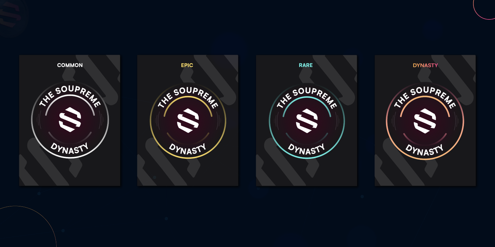

# NFT Augmenter Capitaux

Les NFTs Soupreme Badge ont été créés pour encourager la contribution du projet et la participation des premiers adopteurs. Ils ont des avantages directs conformément à notre programme de jalonnement - c'est pour encourager l'utilisation, ainsi que de créer un marché sain pour nos NFTs.

Les badges NFT Finance Soup détiennent beaucoup de valeur intrinsèque avec des droits exclusifs sur la plate-forme Soup Finance et d'autres chaînes de blocs activées... Certains droits exclusifs comprennent:

* Vérification des premiers partisans.
* Droits d'accès exclusifs à notre Testnet.
* Participation exclusive aux cadeaux.
* Discord channel pass privé.
* Booster de récompenses de piqûre.
* Contourner la fonction de récompenses.
* verrouillées dans le temps et gagner des intérêts sur le marché de prêt NFT bientôt lancé.
* Commerce de n'importe quelle chaîne Fusion activé marché NFT.

**Jalonner des Booster Récompenses**

Par exemple, si vous piquez 1000 $ de jetons $SOUP ou LP et possédez un NFT qui fournit un coup de pouce de 13%, votre capital piqué vaudra 1130 $ même si vous n'avez déposé que 1000 $, amplifiant les récompenses gagnées.

De plus, ces NFTs peuvent être empilés pour augmenter davantage votre capital de base (avec une pile maximale de 2 NFTs)... Par exemple, si vous possédez deux NFTs, où l'un a un coup de pouce de 21% et l'autre 13%, la valeur efficace de votre capital piqué deviendra 134% (ou 1340 $ dans l'exemple ci-dessus.).
