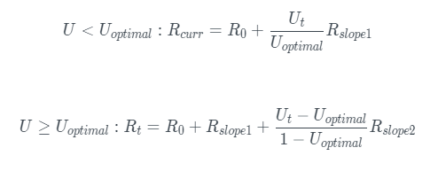

# Modèle de Taux d'Intérêt.

Les taux d'intérêt se divisent en deux catégories:

les taux d'emprunteurs et les taux des fournisseurs.

Les taux des fournisseurs sont les taux annualisés payés aux fournisseurs, tandis que les taux d'emprunteurs sont les taux annualisés payés par les emprunteurs.

* Lorsque _U_ < _U optimal_ les taux d'intérêt d'emprunt augmentent lentement avec l'utilisation.
* Lorsque _U_ > _U optimal_ les taux d'intérêt d'emprunt augmentent fortement pour encourager plus de dépôt et éviter le risque de liquidité.
